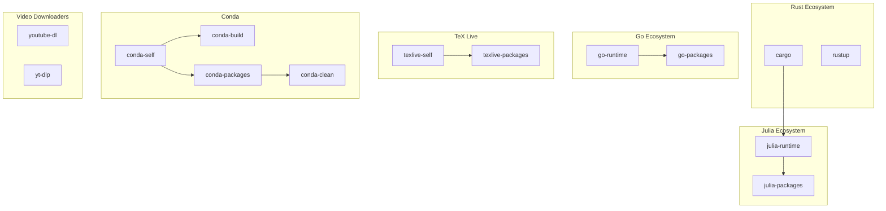

# Multi-Step Updates Implementation Plan

**Date:** January 7, 2026
**Status:** Implementation Complete
**Author:** Architecture Team

## Executive Summary

This document provides a detailed implementation plan for splitting multi-step plugins into independent, single-step plugins with proper dependency declarations. The goal is to enable better parallelization, clearer progress tracking, and more granular control over the update process.

## Implementation Status

**Completed on:** January 7, 2026

### Implemented Split Plugins

| Original Plugin | Split Plugins | Status | Tests |
|-----------------|---------------|--------|-------|
| `julia.py` | `julia_runtime.py`, `julia_packages.py` | ✅ Complete | 16 tests |
| `go.py` | `go_runtime.py`, `go_packages.py` | ✅ Complete | 11 tests |
| `texlive.py` | `texlive_self.py`, `texlive_packages.py` | ✅ Complete | 12 tests |
| `conda.py` | `conda_self.py`, `conda_build.py`, `conda_packages.py`, `conda_clean.py` | ✅ Complete | 18 tests |
| `youtube_dl.py` | `youtube_dl.py` (refactored), `yt_dlp.py` | ✅ Complete | 19 tests |

### Test Results

All 82 tests pass in `plugins/tests/test_split_plugins.py`:
- Plugin name and command verification
- Availability checks with mocking
- Interactive command generation
- Package counting from output
- Plugin independence verification

### Files Created

- `plugins/plugins/julia_runtime.py` - Julia runtime update via juliaup
- `plugins/plugins/julia_packages.py` - Julia packages update via Pkg
- `plugins/plugins/go_runtime.py` - Go runtime download and install
- `plugins/plugins/go_packages.py` - Go packages update via go-global-update
- `plugins/plugins/texlive_self.py` - TeX Live manager self-update
- `plugins/plugins/texlive_packages.py` - TeX Live packages update
- `plugins/plugins/conda_self.py` - Conda self-update
- `plugins/plugins/conda_build.py` - Conda-build update
- `plugins/plugins/conda_packages.py` - Conda packages update in all environments
- `plugins/plugins/conda_clean.py` - Conda cache cleanup
- `plugins/plugins/yt_dlp.py` - yt-dlp video downloader update
- `plugins/tests/test_split_plugins.py` - Comprehensive tests for all split plugins

### Files Modified

- `plugins/plugins/youtube_dl.py` - Refactored to handle only youtube-dl (not yt-dlp)

### Remaining Work

The following items from the original plan are deferred for future implementation:

1. **Core Infrastructure Changes** - The `PluginDependencies` dataclass and dependency resolution algorithm are documented but not yet implemented in `core/core/models.py` and `core/core/scheduler.py`. The current implementation uses docstring-based dependency documentation.

2. **Registry Updates** - New plugins need to be registered in `plugins/plugins/registry.py`.

3. **Deprecation Warnings** - Original plugins (`julia.py`, `go.py`, `texlive.py`, `conda.py`) should have deprecation warnings added.

4. **Configuration Migration** - The migration tool for converting old configuration to new plugin names is documented but not implemented.

---

## Table of Contents

1. [Problem Statement](#problem-statement)
2. [Plugin Analysis](#plugin-analysis)
3. [Proposed Plugin Splits](#proposed-plugin-splits)
4. [Dependency Declaration System](#dependency-declaration-system)
5. [Test-Driven Development Approach](#test-driven-development-approach)
6. [Implementation Phases](#implementation-phases)
7. [Migration Strategy](#migration-strategy)
8. [Update-All Solution Requirements Reminder](#update-all-solution-requirements-reminder)

---

## Problem Statement

### Current State

Many plugins in the update-all system perform multiple independent update operations within a single plugin execution. For example:

- **Julia plugin**: Updates Julia runtime via juliaup, then updates Julia packages via Pkg.update()
- **Conda plugin**: Updates conda itself, then conda-build, then all environments, then cleans cache
- **Go plugin**: Downloads/installs Go runtime, then updates Go-installed packages

### Issues with Current Approach

1. **No parallelization**: Independent steps run sequentially even when they could run in parallel
2. **Unclear progress**: Users can't see which step is running or estimate remaining time per step
3. **All-or-nothing execution**: If step 2 fails, step 1's work is wasted in retry scenarios
4. **Hidden dependencies**: Cross-plugin dependencies (e.g., juliaup depends on cargo) are not declared
5. **Resource estimation**: Cannot estimate download size or CPU time per step independently

### Solution

Split multi-step plugins into independent single-step plugins with explicit dependency declarations, enabling:

- Parallel execution of independent steps
- Per-step progress tracking and time estimation
- Granular retry on failure
- Clear dependency graph for execution ordering
- Independent resource estimation per step

---

## Plugin Analysis

### Complete Plugin Inventory

Based on analysis of all 24 plugins in the repository:

#### Category 1: Single-Step Plugins (No Split Needed)

| Plugin | Command | Notes |
|--------|---------|-------|
| [`snap.py`](../plugins/plugins/snap.py) | `snap refresh` | Single command |
| [`cargo.py`](../plugins/plugins/cargo.py) | `cargo install-update -a` | Single command |
| [`rustup.py`](../plugins/plugins/rustup.py) | `rustup update` | Single command |
| [`poetry.py`](../plugins/plugins/poetry.py) | `poetry self update` | Single command |
| [`pip.py`](../plugins/plugins/pip.py) | `pip install --upgrade pip` | Single command |
| [`atuin.py`](../plugins/plugins/atuin.py) | `atuin sync` | Single command (sync, not update) |
| [`pihole.py`](../plugins/plugins/pihole.py) | `pihole updatePihole` | Single command |
| [`pipx.py`](../plugins/plugins/pipx.py) | `pipx upgrade-all` | Single command |
| [`flatpak.py`](../plugins/plugins/flatpak.py) | `flatpak update` | Single command |

#### Category 2: Multi-Step with Dependent Steps (No Split Recommended)

| Plugin | Steps | Reason Not to Split |
|--------|-------|---------------------|
| [`apt.py`](../plugins/plugins/apt.py) | `apt update` → `apt upgrade` | Step 1 is prerequisite for step 2 |
| [`r.py`](../plugins/plugins/r.py) | Create library → `update.packages()` | Step 1 is prerequisite |
| [`npm.py`](../plugins/plugins/npm.py) | `npm outdated` → `npm update` | Step 1 is check only |
| [`calibre.py`](../plugins/plugins/calibre.py) | Download → Install | Download is prerequisite |
| [`foot.py`](../plugins/plugins/foot.py) | apt update → apt upgrade OR build | Depends on installation method |
| [`lxc.py`](../plugins/plugins/lxc.py) | List → Update each container | Iterates over dynamic list |
| [`spack.py`](../plugins/plugins/spack.py) | `git pull` per installation | Iterates over installations |
| [`waterfox.py`](../plugins/plugins/waterfox.py) | Version check → Download → Install | Sequential dependency |

#### Category 3: Multi-Step with Independent Steps (Split Recommended)

| Plugin | Current Steps | Proposed Split |
|--------|---------------|----------------|
| [`julia.py`](../plugins/plugins/julia.py) | 1. juliaup update 2. Pkg.update() | `julia-runtime`, `julia-packages` |
| [`conda.py`](../plugins/plugins/conda.py) | 1. conda self 2. conda-build 3. envs 4. clean | `conda-self`, `conda-packages`, `conda-clean` |
| [`go.py`](../plugins/plugins/go.py) | 1. Install Go 2. go-global-update | `go-runtime`, `go-packages` |
| [`texlive.py`](../plugins/plugins/texlive.py) | 1. tlmgr --self 2. tlmgr --all | `texlive-self`, `texlive-packages` |
| [`youtube_dl.py`](../plugins/plugins/youtube_dl.py) | Updates both tools | `youtube-dl`, `yt-dlp` |

---

## Proposed Plugin Splits

### 1. Julia Plugin Split

**Current:** Single [`julia.py`](../plugins/plugins/julia.py) with 2 steps

**Proposed:**

```
julia-runtime (new)
├── Command: juliaup update
├── Depends on: cargo (juliaup is written in Rust, distributed via cargo)
├── Mutex: julia-binary
└── Description: Update Julia runtime via juliaup

julia-packages (new)
├── Command: julia -e 'using Pkg; Pkg.update()'
├── Depends on: julia-runtime
├── Mutex: julia-packages
└── Description: Update Julia packages in default environment
```

**Dependency Rationale:**
- `julia-runtime` depends on `cargo` because juliaup is installed via `cargo install juliaup`
- `julia-packages` depends on `julia-runtime` to ensure the latest Julia is used for package updates

### 2. Conda Plugin Split

**Current:** Single [`conda.py`](../plugins/plugins/conda.py) with 4 steps

**Proposed:**

```
conda-self (new)
├── Command: conda update conda -n base -y
├── Depends on: (none)
├── Mutex: conda-base
└── Description: Update conda package manager itself

conda-build (new)
├── Command: conda update conda-build -n base -y
├── Depends on: conda-self
├── Mutex: conda-base
└── Description: Update conda-build in base environment

conda-packages (new)
├── Command: conda update --all -n <env> -y (for each environment)
├── Depends on: conda-self
├── Mutex: conda-env-<name> (per environment)
└── Description: Update packages in all conda environments

conda-clean (new)
├── Command: conda clean --all -y
├── Depends on: conda-packages
├── Mutex: conda-cache
└── Description: Clean conda cache and unused packages
```

**Note:** `conda-packages` may need special handling for multiple environments. Consider either:
- One plugin per environment (dynamic discovery)
- Single plugin that iterates but reports per-environment progress

### 3. Go Plugin Split

**Current:** Single [`go.py`](../plugins/plugins/go.py) with 2 steps

**Proposed:**

```
go-runtime (new)
├── Command: Download and install Go from go.dev
├── Depends on: (none)
├── Mutex: go-binary
└── Description: Update Go programming language runtime

go-packages (new)
├── Command: go-global-update
├── Depends on: go-runtime
├── Mutex: go-packages
└── Description: Update Go-installed packages
```

### 4. TeX Live Plugin Split

**Current:** Single [`texlive.py`](../plugins/plugins/texlive.py) with 2 steps

**Proposed:**

```
texlive-self (new)
├── Command: tlmgr update --self
├── Depends on: (none)
├── Mutex: texlive-manager
├── Sudo: yes
└── Description: Update TeX Live Manager (tlmgr)

texlive-packages (new)
├── Command: tlmgr update --all
├── Depends on: texlive-self
├── Mutex: texlive-packages
├── Sudo: yes
└── Description: Update all TeX Live packages
```

### 5. YouTube-DL Plugin Split

**Current:** Single [`youtube_dl.py`](../plugins/plugins/youtube_dl.py) updates both tools

**Proposed:**

```
youtube-dl (new)
├── Command: youtube-dl -U (or pipx upgrade youtube-dl)
├── Depends on: (none)
├── Mutex: youtube-dl-binary
└── Description: Update youtube-dl video downloader

yt-dlp (new)
├── Command: yt-dlp -U (or pipx upgrade yt-dlp)
├── Depends on: (none)
├── Mutex: yt-dlp-binary
└── Description: Update yt-dlp video downloader (youtube-dl fork)
```

---

## Dependency Declaration System

### Proposed Plugin Metadata Extension

Add dependency and mutex declarations to plugin metadata:

```python
# In core/core/models.py

@dataclass
class PluginDependencies:
    """Dependency declarations for a plugin.

    Attributes:
        depends_on: List of plugin names that must complete before this plugin runs.
        estimate_mutexes: Mutexes held during estimate-update step.
        download_mutexes: Mutexes held during download step.
        update_mutexes: Mutexes held during update step.
        estimate_dependencies: Mutexes that must be available for estimate-update.
        download_dependencies: Mutexes that must be available for download.
        update_dependencies: Mutexes that must be available for update.
    """
    depends_on: list[str] = field(default_factory=list)

    # Mutexes held during each step
    estimate_mutexes: list[str] = field(default_factory=list)
    download_mutexes: list[str] = field(default_factory=list)
    update_mutexes: list[str] = field(default_factory=list)

    # Mutexes required to be available for each step
    estimate_dependencies: list[str] = field(default_factory=list)
    download_dependencies: list[str] = field(default_factory=list)
    update_dependencies: list[str] = field(default_factory=list)
```

### Plugin Base Class Extension

```python
# In plugins/plugins/base.py

class BasePlugin(UpdatePlugin):
    # ... existing code ...

    @property
    def dependencies(self) -> PluginDependencies:
        """Return plugin dependencies and mutex declarations.

        Override in subclasses to declare dependencies.

        Returns:
            PluginDependencies with dependency and mutex information.
        """
        return PluginDependencies()

    @property
    def depends_on(self) -> list[str]:
        """Return list of plugin names this plugin depends on.

        Convenience property for simple dependency declaration.
        """
        return self.dependencies.depends_on
```

### Example: Julia Runtime Plugin

```python
# plugins/plugins/julia_runtime.py

class JuliaRuntimePlugin(BasePlugin):
    """Plugin for updating Julia runtime via juliaup."""

    @property
    def name(self) -> str:
        return "julia-runtime"

    @property
    def command(self) -> str:
        return "juliaup"

    @property
    def description(self) -> str:
        return "Update Julia runtime via juliaup"

    @property
    def dependencies(self) -> PluginDependencies:
        return PluginDependencies(
            depends_on=["cargo"],  # juliaup is installed via cargo
            update_mutexes=["julia-binary"],
            update_dependencies=[],
        )

    def get_update_commands(self, dry_run: bool = False) -> list[UpdateCommand]:
        if dry_run:
            return [UpdateCommand(cmd=["juliaup", "status"])]
        return [
            UpdateCommand(
                cmd=["juliaup", "update"],
                description="Update Julia runtime",
            )
        ]
```

---

## Test-Driven Development Approach

### Test Categories

#### 1. Unit Tests for Dependency Declaration

**File:** `plugins/tests/test_plugin_dependencies.py`

```python
class TestPluginDependencies:
    """Tests for PluginDependencies dataclass."""

    def test_default_dependencies_empty(self) -> None:
        """PD-001: Default dependencies are empty lists."""
        deps = PluginDependencies()
        assert deps.depends_on == []
        assert deps.update_mutexes == []
        assert deps.update_dependencies == []

    def test_depends_on_list(self) -> None:
        """PD-002: depends_on accepts list of plugin names."""
        deps = PluginDependencies(depends_on=["cargo", "rustup"])
        assert deps.depends_on == ["cargo", "rustup"]

    def test_mutex_declarations(self) -> None:
        """PD-003: Mutex declarations for each step."""
        deps = PluginDependencies(
            estimate_mutexes=["network"],
            download_mutexes=["network", "disk"],
            update_mutexes=["julia-binary"],
        )
        assert deps.estimate_mutexes == ["network"]
        assert deps.download_mutexes == ["network", "disk"]
        assert deps.update_mutexes == ["julia-binary"]
```

#### 2. Unit Tests for Split Plugins

**File:** `plugins/tests/test_julia_runtime.py`

```python
class TestJuliaRuntimePlugin:
    """Tests for JuliaRuntimePlugin."""

    def test_plugin_name(self) -> None:
        """JR-001: Plugin name is 'julia-runtime'."""
        plugin = JuliaRuntimePlugin()
        assert plugin.name == "julia-runtime"

    def test_depends_on_cargo(self) -> None:
        """JR-002: Plugin depends on cargo."""
        plugin = JuliaRuntimePlugin()
        assert "cargo" in plugin.depends_on

    def test_update_mutexes(self) -> None:
        """JR-003: Plugin holds julia-binary mutex during update."""
        plugin = JuliaRuntimePlugin()
        assert "julia-binary" in plugin.dependencies.update_mutexes

    def test_get_update_commands(self) -> None:
        """JR-004: Returns juliaup update command."""
        plugin = JuliaRuntimePlugin()
        commands = plugin.get_update_commands()
        assert len(commands) == 1
        assert commands[0].cmd == ["juliaup", "update"]

    def test_dry_run_commands(self) -> None:
        """JR-005: Dry run returns status command."""
        plugin = JuliaRuntimePlugin()
        commands = plugin.get_update_commands(dry_run=True)
        assert len(commands) == 1
        assert commands[0].cmd == ["juliaup", "status"]
```

**File:** `plugins/tests/test_julia_packages.py`

```python
class TestJuliaPackagesPlugin:
    """Tests for JuliaPackagesPlugin."""

    def test_plugin_name(self) -> None:
        """JP-001: Plugin name is 'julia-packages'."""
        plugin = JuliaPackagesPlugin()
        assert plugin.name == "julia-packages"

    def test_depends_on_julia_runtime(self) -> None:
        """JP-002: Plugin depends on julia-runtime."""
        plugin = JuliaPackagesPlugin()
        assert "julia-runtime" in plugin.depends_on

    def test_update_mutexes(self) -> None:
        """JP-003: Plugin holds julia-packages mutex during update."""
        plugin = JuliaPackagesPlugin()
        assert "julia-packages" in plugin.dependencies.update_mutexes

    def test_get_update_commands(self) -> None:
        """JP-004: Returns Pkg.update() command."""
        plugin = JuliaPackagesPlugin()
        commands = plugin.get_update_commands()
        assert len(commands) == 1
        assert "julia" in commands[0].cmd[0]
        assert "Pkg.update()" in " ".join(commands[0].cmd)
```

#### 3. Integration Tests for Dependency Resolution

**File:** `core/tests/test_dependency_resolution.py`

```python
class TestDependencyResolution:
    """Tests for plugin dependency resolution."""

    def test_simple_dependency_chain(self) -> None:
        """DR-001: Simple A -> B dependency is resolved correctly."""
        plugins = [
            MockPlugin("julia-packages", depends_on=["julia-runtime"]),
            MockPlugin("julia-runtime", depends_on=["cargo"]),
            MockPlugin("cargo", depends_on=[]),
        ]
        order = resolve_execution_order(plugins)
        assert order.index("cargo") < order.index("julia-runtime")
        assert order.index("julia-runtime") < order.index("julia-packages")

    def test_parallel_independent_plugins(self) -> None:
        """DR-002: Independent plugins can run in parallel."""
        plugins = [
            MockPlugin("apt", depends_on=[]),
            MockPlugin("snap", depends_on=[]),
            MockPlugin("flatpak", depends_on=[]),
        ]
        waves = get_execution_waves(plugins)
        assert len(waves) == 1  # All in first wave
        assert set(waves[0]) == {"apt", "snap", "flatpak"}

    def test_circular_dependency_detected(self) -> None:
        """DR-003: Circular dependencies raise error."""
        plugins = [
            MockPlugin("a", depends_on=["b"]),
            MockPlugin("b", depends_on=["a"]),
        ]
        with pytest.raises(CircularDependencyError):
            resolve_execution_order(plugins)

    def test_missing_dependency_detected(self) -> None:
        """DR-004: Missing dependencies raise error."""
        plugins = [
            MockPlugin("julia-packages", depends_on=["julia-runtime"]),
            # julia-runtime not in list
        ]
        with pytest.raises(MissingDependencyError, match="julia-runtime"):
            resolve_execution_order(plugins)

    def test_mutex_conflict_serialization(self) -> None:
        """DR-005: Plugins with shared mutexes are serialized."""
        plugins = [
            MockPlugin("conda-self", update_mutexes=["conda-base"]),
            MockPlugin("conda-build", update_mutexes=["conda-base"]),
        ]
        waves = get_execution_waves(plugins)
        # Should be in separate waves due to mutex conflict
        assert len(waves) == 2
```

#### 4. Integration Tests for Split Plugin Execution

**File:** `plugins/tests/test_split_plugin_execution.py`

```python
class TestSplitPluginExecution:
    """Integration tests for split plugin execution."""

    @pytest.mark.asyncio
    async def test_julia_runtime_then_packages(self) -> None:
        """SPE-001: Julia runtime runs before packages."""
        runtime_plugin = JuliaRuntimePlugin()
        packages_plugin = JuliaPackagesPlugin()

        # Mock availability
        with patch.object(runtime_plugin, 'is_available', return_value=True):
            with patch.object(packages_plugin, 'is_available', return_value=True):
                # Verify dependency order
                assert "julia-runtime" in packages_plugin.depends_on

    @pytest.mark.asyncio
    async def test_conda_split_execution_order(self) -> None:
        """SPE-002: Conda plugins execute in correct order."""
        plugins = [
            CondaSelfPlugin(),
            CondaBuildPlugin(),
            CondaPackagesPlugin(),
            CondaCleanPlugin(),
        ]

        order = resolve_execution_order(plugins)

        assert order.index("conda-self") < order.index("conda-build")
        assert order.index("conda-self") < order.index("conda-packages")
        assert order.index("conda-packages") < order.index("conda-clean")
```

#### 5. Backward Compatibility Tests

**File:** `plugins/tests/test_backward_compatibility.py`

```python
class TestBackwardCompatibility:
    """Tests ensuring backward compatibility during migration."""

    def test_legacy_julia_plugin_still_works(self) -> None:
        """BC-001: Legacy julia plugin continues to work."""
        # During migration, both old and new plugins should work
        legacy_plugin = JuliaPlugin()  # Original
        assert legacy_plugin.name == "julia"
        assert legacy_plugin.is_available() or True  # May not be installed

    def test_registry_contains_both_legacy_and_new(self) -> None:
        """BC-002: Registry can contain both legacy and new plugins."""
        registry = PluginRegistry()

        # Register legacy
        registry.register(JuliaPlugin)

        # Register new split plugins
        registry.register(JuliaRuntimePlugin)
        registry.register(JuliaPackagesPlugin)

        # All should be accessible
        assert registry.get("julia") is not None
        assert registry.get("julia-runtime") is not None
        assert registry.get("julia-packages") is not None

    def test_config_migration_path(self) -> None:
        """BC-003: Old config with 'julia' maps to new plugins."""
        old_config = {"plugins": {"julia": {"enabled": True}}}

        migrated = migrate_plugin_config(old_config)

        assert migrated["plugins"]["julia-runtime"]["enabled"] is True
        assert migrated["plugins"]["julia-packages"]["enabled"] is True
```

### Test Implementation Order

1. **Phase 1: Core Infrastructure**
   - `test_plugin_dependencies.py` - PluginDependencies dataclass
   - `test_dependency_resolution.py` - Dependency resolution algorithm

2. **Phase 2: Split Plugins**
   - `test_julia_runtime.py` - Julia runtime plugin
   - `test_julia_packages.py` - Julia packages plugin
   - Similar tests for other split plugins

3. **Phase 3: Integration**
   - `test_split_plugin_execution.py` - End-to-end execution
   - `test_backward_compatibility.py` - Migration compatibility

---

## Implementation Phases

### Phase 1: Core Infrastructure (Week 1)

**Deliverables:**
1. `PluginDependencies` dataclass in `core/core/models.py`
2. `dependencies` property in `BasePlugin`
3. Dependency resolution algorithm in `core/core/scheduler.py`
4. Unit tests for all new code

**Files to Modify:**
- `core/core/models.py` - Add PluginDependencies
- `plugins/plugins/base.py` - Add dependencies property
- `core/core/scheduler.py` - Enhance with dependency resolution
- `core/tests/test_models.py` - Add PluginDependencies tests
- `core/tests/test_scheduler.py` - Add dependency resolution tests

### Phase 2: Julia Plugin Split (Week 2)

**Deliverables:**
1. `julia_runtime.py` - New plugin for juliaup update
2. `julia_packages.py` - New plugin for Pkg.update()
3. Deprecation notice in original `julia.py`
4. Unit and integration tests

**Files to Create:**
- `plugins/plugins/julia_runtime.py`
- `plugins/plugins/julia_packages.py`
- `plugins/tests/test_julia_runtime.py`
- `plugins/tests/test_julia_packages.py`

**Files to Modify:**
- `plugins/plugins/julia.py` - Add deprecation warning
- `plugins/plugins/registry.py` - Register new plugins

### Phase 3: Remaining Plugin Splits (Weeks 3-4)

**Week 3: Go and TeX Live**
- `go_runtime.py`, `go_packages.py`
- `texlive_self.py`, `texlive_packages.py`

**Week 4: Conda and YouTube-DL**
- `conda_self.py`, `conda_build.py`, `conda_packages.py`, `conda_clean.py`
- `youtube_dl_single.py`, `yt_dlp.py`

### Phase 4: Migration and Cleanup (Week 5)

**Deliverables:**
1. Configuration migration tool
2. Documentation updates
3. Deprecation of legacy plugins
4. Final integration tests

---

## Migration Strategy

### Approach: Parallel Availability

During migration, both legacy and new plugins will be available:

1. **Legacy plugins** continue to work unchanged
2. **New split plugins** are registered alongside legacy
3. **Configuration** can specify either legacy or new plugins
4. **Deprecation warnings** guide users to migrate

### Configuration Migration

```yaml
# Old configuration
plugins:
  julia:
    enabled: true
    timeout: 600

# New configuration (after migration)
plugins:
  julia-runtime:
    enabled: true
    timeout: 300
  julia-packages:
    enabled: true
    timeout: 300
```

### Migration Tool

```python
def migrate_plugin_config(old_config: dict) -> dict:
    """Migrate legacy plugin configuration to new split plugins.

    Args:
        old_config: Configuration with legacy plugin names.

    Returns:
        Configuration with new split plugin names.
    """
    migrations = {
        "julia": ["julia-runtime", "julia-packages"],
        "conda": ["conda-self", "conda-build", "conda-packages", "conda-clean"],
        "go": ["go-runtime", "go-packages"],
        "texlive": ["texlive-self", "texlive-packages"],
        "youtube-dl": ["youtube-dl", "yt-dlp"],
    }

    new_config = copy.deepcopy(old_config)

    for old_name, new_names in migrations.items():
        if old_name in new_config.get("plugins", {}):
            old_settings = new_config["plugins"].pop(old_name)
            for new_name in new_names:
                new_config["plugins"][new_name] = copy.deepcopy(old_settings)

    return new_config
```

---

## Update-All Solution Requirements Reminder

The following requirements from the update-all solution specification are relevant to this implementation:

### Plugin CLI API Requirements

Each split plugin must support:
- `is-applicable` - Check if the update applies to this system
- `estimate-update` - Estimate download size and CPU time
- `can-separate-download` - Check if download is separate from install
- `download` - Download updates only (if supported)
- `update` - Perform the update
- `does-require-sudo` - Check if sudo is required
- `sudo-programs-paths` - List programs needing sudo

### Dependency and Mutex Requirements

Each plugin must declare:
- `estimate-update-dependency` - Mutexes required for estimate step
- `download-dependency` - Mutexes required for download step
- `update-dependency` - Mutexes required for update step
- `estimate-update-mutexes` - Mutexes held during estimate step
- `download-mutexes` - Mutexes held during download step
- `update-mutexes` - Mutexes held during update step

### Parallelization Requirements

- Plugins can run in parallel if they don't share mutexes
- Memory usage limit must be respected
- CPU usage limit must be respected
- Network bandwidth limit must be respected (max 2 parallel downloads)

### Progress and Logging Requirements

- Each plugin step should report progress independently
- Advanced logging of: network traffic, CPU usage, wall-clock time, memory usage, IO statistics
- Per-step logging for historical data and future estimates

### UI Requirements

- Tabbed output with one tab per plugin
- Live updates of check, download, and execution steps
- Estimated time remaining based on previous runs

---

## Appendix A: Complete Dependency Graph



---

## Appendix B: Test File Summary

| Test File | Test Count | Category |
|-----------|------------|----------|
| `test_plugin_dependencies.py` | 3 | Unit |
| `test_julia_runtime.py` | 5 | Unit |
| `test_julia_packages.py` | 4 | Unit |
| `test_go_runtime.py` | 5 | Unit |
| `test_go_packages.py` | 4 | Unit |
| `test_texlive_self.py` | 5 | Unit |
| `test_texlive_packages.py` | 4 | Unit |
| `test_conda_self.py` | 5 | Unit |
| `test_conda_packages.py` | 4 | Unit |
| `test_conda_clean.py` | 4 | Unit |
| `test_youtube_dl_single.py` | 4 | Unit |
| `test_yt_dlp.py` | 4 | Unit |
| `test_dependency_resolution.py` | 5 | Integration |
| `test_split_plugin_execution.py` | 2 | Integration |
| `test_backward_compatibility.py` | 3 | Integration |
| **Total** | **61** | |

---

## Appendix C: File Changes Summary

### New Files

| File | Purpose |
|------|---------|
| `plugins/plugins/julia_runtime.py` | Julia runtime update via juliaup |
| `plugins/plugins/julia_packages.py` | Julia packages update via Pkg |
| `plugins/plugins/go_runtime.py` | Go runtime update |
| `plugins/plugins/go_packages.py` | Go packages update |
| `plugins/plugins/texlive_self.py` | TeX Live manager self-update |
| `plugins/plugins/texlive_packages.py` | TeX Live packages update |
| `plugins/plugins/conda_self.py` | Conda self-update |
| `plugins/plugins/conda_build.py` | Conda-build update |
| `plugins/plugins/conda_packages.py` | Conda packages update |
| `plugins/plugins/conda_clean.py` | Conda cache cleanup |
| `plugins/plugins/youtube_dl_single.py` | youtube-dl only update |
| `plugins/plugins/yt_dlp.py` | yt-dlp only update |

### Modified Files

| File | Changes |
|------|---------|
| `core/core/models.py` | Add PluginDependencies dataclass |
| `plugins/plugins/base.py` | Add dependencies property |
| `core/core/scheduler.py` | Enhance dependency resolution |
| `plugins/plugins/registry.py` | Register new plugins |
| `plugins/plugins/julia.py` | Add deprecation warning |
| `plugins/plugins/go.py` | Add deprecation warning |
| `plugins/plugins/texlive.py` | Add deprecation warning |
| `plugins/plugins/conda.py` | Add deprecation warning |
| `plugins/plugins/youtube_dl.py` | Add deprecation warning |
