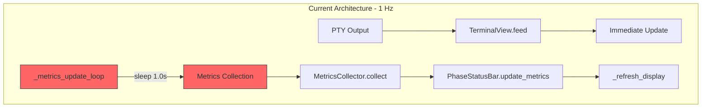
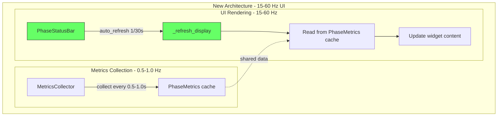

# UI Latency Improvement Plan

## Executive Summary

The current UI update latency in the interactive screen is **1.0 seconds (1 Hz)** for the metrics/status bar, with a minimum possible value of **0.5 seconds (2 Hz)** due to the `MIN_UPDATE_INTERVAL` constraint. The goal is to achieve **15-60 Hz** refresh rate for a smooth user experience.

## Current Architecture Analysis

### Bottleneck Identification



**Root Cause**: The UI refresh is tied to metrics collection in [`TerminalPane._metrics_update_loop()`](ui/ui/terminal_pane.py:637), which sleeps for `metrics_update_interval` (default 1.0s, minimum 0.5s) between updates.

### Key Files and Components

| Component | File | Current Latency | Issue |
|-----------|------|-----------------|-------|
| `PaneConfig.metrics_update_interval` | [`ui/ui/terminal_pane.py:75`](ui/ui/terminal_pane.py:75) | 1.0s default | Too slow |
| `MetricsCollector.MIN_UPDATE_INTERVAL` | [`ui/ui/metrics.py:451`](ui/ui/metrics.py:451) | 0.5s minimum | Enforced floor |
| `_metrics_update_loop` | [`ui/ui/terminal_pane.py:637`](ui/ui/terminal_pane.py:637) | 1.0s sleep | Blocks UI updates |
| `PhaseStatusBar.metrics` reactive | [`ui/ui/phase_status_bar.py:111`](ui/ui/phase_status_bar.py:111) | N/A | Good - uses Textual reactive |
| `BatchedEventHandler` | [`ui/ui/event_handler.py:148`](ui/ui/event_handler.py:148) | 50ms batch, 30 FPS | Good for streaming |

### Textual Framework Capabilities

From the Textual source code analysis:
- **MAX_FPS**: 60 FPS default (configurable via `TEXTUAL_FPS` env var) - [`ref/textual/src/textual/constants.py:143`](ref/textual/src/textual/constants.py:143)
- **`auto_refresh` property**: Allows widgets to refresh at specified intervals - [`ref/textual/src/textual/dom.py:459-472`](ref/textual/src/textual/dom.py:459)
- **`set_interval()`**: Timer-based callbacks for periodic updates - [`ref/textual/src/textual/message_pump.py:409`](ref/textual/src/textual/message_pump.py:409)
- **Reactive properties**: Automatic UI refresh when values change - already used in `PhaseStatusBar`

## Proposed Solution

### Architecture Change: Separate Metrics Collection from UI Rendering



### Key Design Decisions

1. **Keep metrics collection at 0.5-1.0 Hz**: psutil calls are expensive and don't need to run faster
2. **Decouple UI refresh from metrics collection**: Use Textual's `auto_refresh` for the status bar
3. **Use cached metrics for display**: The status bar reads from cached `PhaseMetrics` instead of triggering collection
4. **Target 30 Hz for status bar**: Good balance between smoothness and CPU usage

## Implementation Plan

### Phase 1: Add `auto_refresh` to PhaseStatusBar

**File**: [`ui/ui/phase_status_bar.py`](ui/ui/phase_status_bar.py)

**Changes**:
1. Set `auto_refresh` property in `__init__` or `on_mount`
2. Override `automatic_refresh()` to call `_refresh_display()` with cached metrics

```python
# In PhaseStatusBar.__init__ or on_mount:
def on_mount(self) -> None:
    # Refresh at 30 Hz for smooth UI
    self.auto_refresh = 1 / 30  # ~33ms

def automatic_refresh(self) -> None:
    # Called by Textual at auto_refresh interval
    # Just refresh display with cached metrics - don't collect new ones
    self._refresh_display()
```

### Phase 2: Modify MetricsCollector to Cache Results

**File**: [`ui/ui/metrics.py`](ui/ui/metrics.py)

**Changes**:
1. Keep `MIN_UPDATE_INTERVAL` at 0.5s for actual psutil collection
2. Add a `_cached_metrics` property that returns the last collected metrics
3. The `collect()` method updates the cache, but UI reads from cache

```python
class MetricsCollector:
    # Keep MIN_UPDATE_INTERVAL at 0.5s - this is for actual collection
    MIN_UPDATE_INTERVAL: ClassVar[float] = 0.5

    def __init__(self, ...):
        # ... existing code ...
        self._cached_metrics: PhaseMetrics = PhaseMetrics()

    @property
    def cached_metrics(self) -> PhaseMetrics:
        # Return cached metrics without triggering collection
        return self._cached_metrics

    def collect(self) -> PhaseMetrics:
        # ... existing collection logic ...
        self._cached_metrics = metrics
        return metrics
```

### Phase 3: Modify TerminalPane to Separate Concerns

**File**: [`ui/ui/terminal_pane.py`](ui/ui/terminal_pane.py)

**Changes**:
1. Keep `_metrics_update_loop` for actual metrics collection at 0.5-1.0 Hz
2. Remove the call to `_phase_status_bar.collect_and_update()` from the loop
3. Let `PhaseStatusBar.auto_refresh` handle UI updates

```python
async def _metrics_update_loop(self) -> None:
    # This loop now ONLY collects metrics, doesn't update UI
    try:
        while self._state == PaneState.RUNNING:
            if self._metrics_collector:
                # Collect metrics in background thread
                await asyncio.to_thread(self._metrics_collector.collect)
            # Keep collection at 0.5-1.0 Hz to avoid CPU overhead
            await asyncio.sleep(self.config.metrics_update_interval)
    except asyncio.CancelledError:
        pass
```

### Phase 4: Update PhaseStatusBar to Use Cached Metrics

**File**: [`ui/ui/phase_status_bar.py`](ui/ui/phase_status_bar.py)

**Changes**:
1. In `_refresh_display()`, read from `_metrics_collector.cached_metrics` if available
2. The reactive `metrics` property is still used for external updates

```python
def _refresh_display(self) -> None:
    # Use cached metrics from collector if available
    if self._metrics_collector:
        m = self._metrics_collector.cached_metrics
    else:
        m = self.metrics

    # ... rest of display logic unchanged ...
```

### Phase 5: Add Configuration Option

**File**: [`ui/ui/terminal_pane.py`](ui/ui/terminal_pane.py)

**Changes**:
1. Add `ui_refresh_rate` to `PaneConfig` (default 30 Hz)
2. Pass this to `PhaseStatusBar` for its `auto_refresh` setting

```python
@dataclass
class PaneConfig:
    # ... existing fields ...

    # UI refresh rate (Hz) - separate from metrics collection
    ui_refresh_rate: float = 30.0  # 30 Hz = ~33ms

    # Metrics collection interval (seconds) - can be slower
    metrics_update_interval: float = 1.0  # Keep at 1.0s for psutil
```

## Implementation Checklist

- [ ] **Phase 1**: Add `auto_refresh` to `PhaseStatusBar`
  - [ ] Add `on_mount()` method to set `auto_refresh = 1 / 30`
  - [ ] Override `automatic_refresh()` to call `_refresh_display()`

- [ ] **Phase 2**: Modify `MetricsCollector` caching
  - [ ] Add `_cached_metrics` field
  - [ ] Add `cached_metrics` property
  - [ ] Update `collect()` to store in cache

- [ ] **Phase 3**: Modify `TerminalPane._metrics_update_loop`
  - [ ] Remove `collect_and_update()` call
  - [ ] Keep loop for background metrics collection only

- [ ] **Phase 4**: Update `PhaseStatusBar._refresh_display`
  - [ ] Read from `cached_metrics` instead of `self.metrics`

- [ ] **Phase 5**: Add configuration
  - [ ] Add `ui_refresh_rate` to `PaneConfig`
  - [ ] Wire up to `PhaseStatusBar.auto_refresh`

- [ ] **Testing**
  - [ ] Update `test_ui_refresh_rate.py` to verify new behavior
  - [ ] Add test for 30 Hz refresh rate
  - [ ] Verify metrics collection still works at 0.5-1.0 Hz
  - [ ] Run `just validate` to ensure all tests pass

## Expected Results

| Metric | Before | After |
|--------|--------|-------|
| Status bar refresh rate | 1 Hz | 30 Hz |
| Metrics collection rate | 1 Hz | 0.5-1.0 Hz |
| Perceived UI latency | 1000ms | ~33ms |
| CPU overhead | Low | Slightly higher (more refreshes) |

## Risk Analysis

| Risk | Mitigation |
|------|------------|
| Increased CPU usage from faster UI refresh | Use `auto_refresh` which is optimized by Textual; only refresh visible widgets |
| Stale metrics displayed | Metrics are still collected at 0.5-1.0 Hz; 1 second staleness is acceptable |
| Breaking existing tests | Update tests to reflect new architecture |
| Complexity increase | Changes are localized to 3-4 files; architecture is cleaner |

## Alternative Approaches Considered

### 1. Simply reduce `MIN_UPDATE_INTERVAL` to 0.033s (30 Hz)
- **Rejected**: Would cause excessive psutil calls and CPU usage
- psutil process monitoring is expensive and doesn't need 30 Hz updates

### 2. Use Textual's reactive system exclusively
- **Partially adopted**: The `metrics` reactive property is already used
- The issue is that the reactive is only updated at 1 Hz from the collection loop

### 3. Use `set_interval()` instead of `auto_refresh`
- **Considered**: Both achieve similar results
- `auto_refresh` is more idiomatic for Textual widgets and handles visibility checks

## References

- Textual `auto_refresh` documentation: [`ref/textual/src/textual/dom.py:459-472`](ref/textual/src/textual/dom.py:459)
- Textual `MAX_FPS` constant: [`ref/textual/src/textual/constants.py:143`](ref/textual/src/textual/constants.py:143)
- Current UI refresh rate tests: [`ui/tests/test_ui_refresh_rate.py`](ui/tests/test_ui_refresh_rate.py)
- Bug investigation report: [`docs/bug-investigation-report.md`](docs/bug-investigation-report.md)
